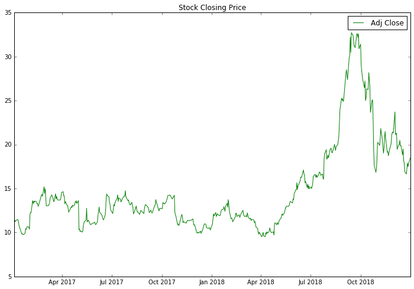

# Simple Stock Analysis in Python

This is tutorial for Simple Stock Analysis. It is very simple and easy to understand for beginners that wants to learn about stock analysis and wants to become a quant. In addition, this tutorial for people that want to learn python for stock analysis. 

The order is from #1 through #26.
You learn number 1 first and you go in order.

## Prerequistes
Python 3.5+

Jupyter Notebook Python 3

## Dependencies
* fix_yahoo_finance
* TensorFlow 1.10.0
* Pandas
* Numpy
* ta-lib
* matlibplot
* sklearn

### Input
Pick a symbol, you want to analyze. 

### symbol = '...' <-- ... input a symbol

Pick a 'start' date and 'end' date for certain time frame to analyze. 

### start = '...' & end = '...' <-- input a date
______________________________________________________________________________________________________________________________
## Examples 
```python
# Libraries
import numpy as np
import pandas as pd
import matplotlib.pyplot as plt

import warnings
warnings.filterwarnings("ignore")

# fix_yahoo_finance is used to fetch data 
import fix_yahoo_finance as yf
yf.pdr_override()

# input
symbol = 'AAPL' # Apple Company
start = '2018-01-01'
end = '2019-01-01'

# Read data 
df = yf.download(symbol,start,end)

# View Columns
df.head()
```

## Example Stock Charts:


## Example Stock Scripts
In command DOS drive 'C:\ ' 

Find where you put the code .py in?

How to run python scripts in command prompt(cmd) or Windows PowerShell?

### Type: python SimpleStockChartScripts.py

## List of questions for simple stock tutorial in python:
______________________________________________________________________________________________________________________________
  1. How to get data from yahoo, quandl, or other sites?
  2. How to scrape historical data, fundamental data, and news data?
  3. How to analyze the stock data?
  4. How to make a trendlines?
  5. How to use Technical Analysis and Fundamental Analysis?
  6. How to add and save to csv file?
  7. How to customize table and make beautiful plot?
  8. How to create class and function for stock?
  9. How to create and run scripts?
  10. How to applied statistics and timeseries for stock?
  11. How to create buy and sell signals? 
  12. How to create stock prediction in machine learning and deep learning?
  13. How to create simple stock strategy?
  14. Example of python libraries for Technical Analysis and fetching historical stock prices.

______________________________________________________________________________________________________________________________

I tried to make it simple as possible to understand finance data and how to analyze the data by using python language.

If you want to learn different simple function for stock analysis, go to:
https://github.com/LastAncientOne/100_Day_Challenge

If you want to learn more advance stock analyze or different language in finance, go to:
https://github.com/LastAncientOne/Stock-Analysis

If you into deep learning or machine learning for finance, go to:
https://github.com/LastAncientOne/Deep-Learning-Machine-Learning-Stock

If you want to learn about Mathematics behind deep learning or machine learning, go to:
https://github.com/LastAncientOne/Mathematics_for_Machine_Learning

## Reading Material
https://www.investopedia.com/terms/s/stock-analysis.asp (Basic Stock Analysis)
https://www.investopedia.com/articles/investing/093014/stock-quotes-explained.asp
https://www.investopedia.com/terms/t/trendline.asp

## Authors
* Tin Hang

## Disclaimer
Do not use this code for investing or trading in the stock market. However, if you are interest in the stock market, you should read books that relate to stock market or finance.

## This is not get rich quick and is for researching and educational purposes.
